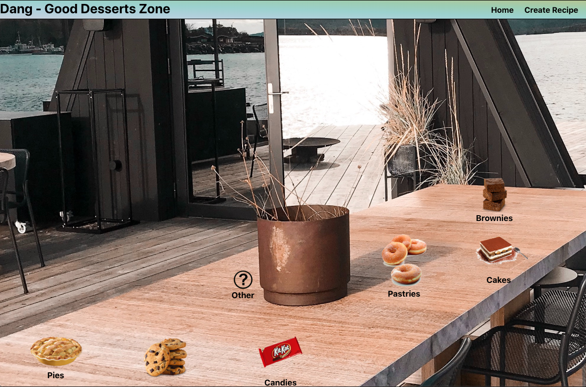
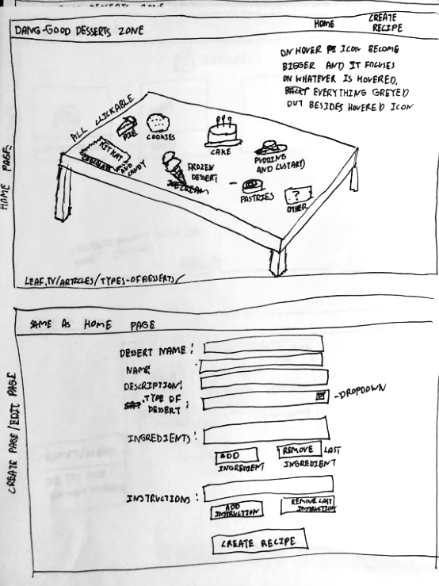
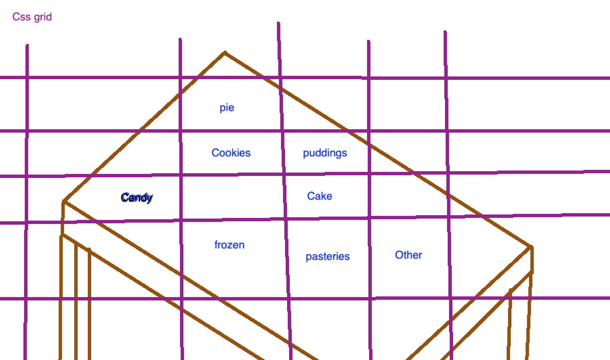
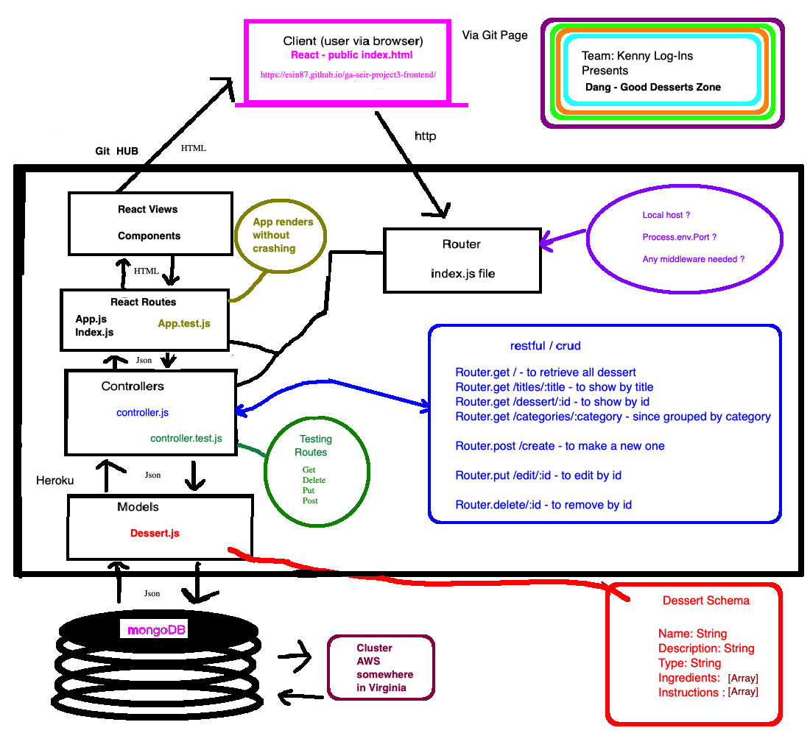

# Dang Good Dessert Zone



## Description

Dang Good Dessert Zone serves up delicious dessert recipes for the busy individual who is looking to satisfy their sweet tooth. Our users are looking for dessert inspiration in the form of fun, accessible recipes. Users can read, create, edit and delete any recipe on our application.

## Technical Specifications

This project was created to fulfill the requirements for the General Assembly Software Engineering Immersive Project 3: to build a full stack MERN (Mongoose, Express, React, Node) application from the ground up. Our group, the "Kenny Log-Ins" (our instructor's name is Kenneth) created for this project our own API that serves JSON data, and a frontend React user interface through which users can perform full CRUD functions on API data via RESTful routes.

## Features

-  **Bronze/Minimum Viable Product:**

   -  [x] Homepage with clickable categories of desserts
   -  [x] Show desserts by category and by individual item
   -  [x] Create, read, update, and delete functionality

-  **Silver:**

   -  [x] Backend Mocha/Chai testing
   -  [x] Responsive design
   -  [x] Form validation

-  **Gold:**

   -  [ ] Search recipes by title and/or keywords
   -  [ ] User image file uploads (instead of URL)

-  **Platinum:**
   -  [ ] User authorization/login to access create, update, and delete functionality
   -  [ ] User comments and likes on dessert posts

## User Stories

We planned this website for a busy user, such as a working parent, who wants to find a quick treat for their family and/or children. The desserts shouldn't break the bank or require too much culinary finesse. This is not the Great British Baking Show (although GBBS is WONDERFUL). All our desserts are fun, fast, easy, and tasty.

-  **What does our user want?** Our user wants to find some dessert inspiration. Many cooking and recipe websites are slow to load, filled with ads and automatically playing videos that detract from the user experience. We wanted to provide a quick way for busy users to find dessert inspo.
-  **How will our application satisfy the user?** The user will be able to see an assortment of different dessert recipe ideas and click on the item to read it. Users who try out recipes and want to edit them can update any aspect of a recipe. Users can also delete recipes that are unsuccessful from the database.

## Wireframes

Our team worked individually on wireframes for design concepts, and when we came back together to review and choose a concept, the homepage table design won out. We aimed for a cozy, inviting, and relaxing design concept that would also be user-friendly.



We also visualized how we would implement the home page concept with the CSS grid tool.



## Technical Planning

Our team planned out the routing and Dessert model schema that we would use for our project. We created our own API database that resides in an Express/Node server hosted on Mongo DB Atlas and rendered on Heroku.

```javascript
//update dessert - by id
router.put('/edit/:id', (req, res) => {
	Dessert.findOneAndUpdate({ _id: req.params.id }, req.body, {
		new: true
	})
		.then(desserts => {
			Dessert.find({}).then(desserts => {
				res.json(desserts);
			});
		})
		.catch(err => console.error(err));
});
```

This API data is served RESTfully to a frontend created through React and hosted on GitHub pages, as shown in the code snippet above from our Express controller file.

The diagram below shows the overall architecture of the backend of our application.



## Team "Kenny Log-Ins" Project Roles & Contributions

-  [**Vincent Chen:**](https://vbc221.github.io/Vincent-Portfolio-Choice/)

   -  Scrum Master
   -  Graphic design / CSS
   -  Home page, Categories page, Show page
   -  Mobile responsiveness

-  [**Eleni Goranites:**](https://www.linkedin.com/in/eleni-goranites/)

   -  Graphic Design / CSS
   -  Database and server design
   -  Express CRUD routes
   -  React components, routing, and Axios calls
   -  Aligning frontend/backend routes

-  [**Brian Loveless:**](https://brianloveless.com)

   -  Graphic Design / CSS
   -  Database creation and management
   -  Backend deployment
   -  Backend Mocha/Chai testing
   -  HTML/CSS Validation
   -  About page

-  [**Esin Saribudak:**](https://www.linkedin.com/in/esinsaribudak/)
   -  Database and server design
   -  Express CRUD routes
   -  React components, routing, and Axios calls
   -  React form validation
   -  Frontend deployment

Please drop any feedback into our issues page, and thanks for visiting our page!


